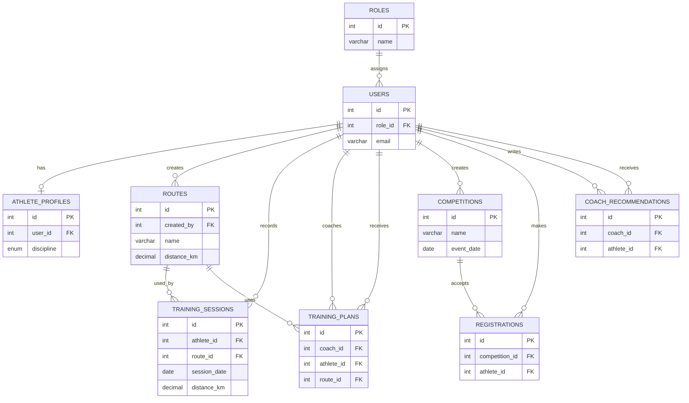

# EnduroTrack draft ERD

Exported versions for submission:

- [ERD diagram as PNG](./ERD.png)
- [ERD diagram as PDF](./ERD.pdf)
- [Editable vector source](./ERD.svg)

```mermaid
erDiagram
    ROLES ||--o{ USERS : assigns
    USERS ||--o| ATHLETE_PROFILES : has
    USERS ||--o{ ROUTES : creates
    USERS ||--o{ TRAINING_SESSIONS : records
    ROUTES ||--o{ TRAINING_SESSIONS : used_by
    USERS ||--o{ TRAINING_PLANS : coaches
    USERS ||--o{ TRAINING_PLANS : receives
    ROUTES ||--o{ TRAINING_PLANS : uses
    USERS ||--o{ COMPETITIONS : creates
    USERS ||--o{ REGISTRATIONS : makes
    COMPETITIONS ||--o{ REGISTRATIONS : accepts
    USERS ||--o{ COACH_RECOMMENDATIONS : writes
    USERS ||--o{ COACH_RECOMMENDATIONS : receives

    ROLES {
      int id PK
      varchar name
    }
    USERS {
      int id PK
      int role_id FK
      varchar email
    }
    ATHLETE_PROFILES {
      int id PK
      int user_id FK
      enum discipline
    }
    ROUTES {
      int id PK
      int created_by FK
      varchar name
      decimal distance_km
    }
    TRAINING_SESSIONS {
      int id PK
      int athlete_id FK
      int route_id FK
      date session_date
      decimal distance_km
    }
    TRAINING_PLANS {
      int id PK
      int coach_id FK
      int athlete_id FK
      int route_id FK
    }
    COMPETITIONS {
      int id PK
      varchar name
      date event_date
    }
    REGISTRATIONS {
      int id PK
      int competition_id FK
      int athlete_id FK
    }
    COACH_RECOMMENDATIONS {
      int id PK
      int coach_id FK
      int athlete_id FK
    }
```
